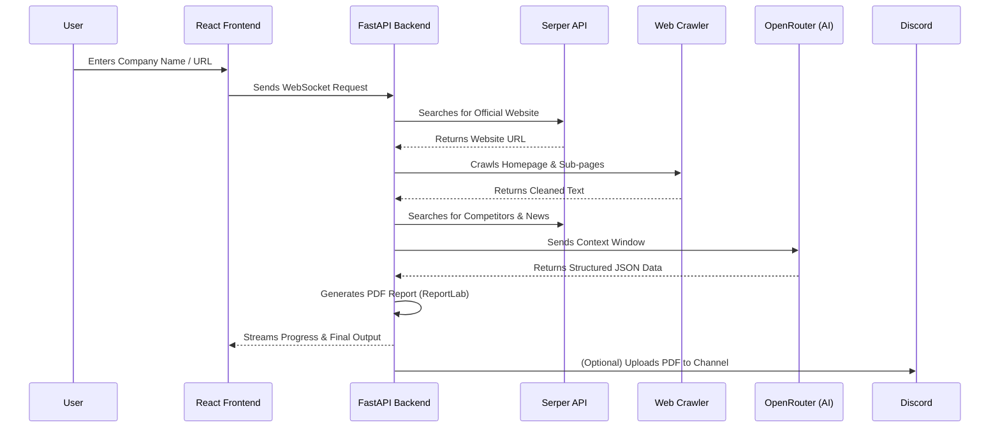

#  Company Research AI


An enterprise-grade, autonomous business intelligence tool that uses Large Language Models, web crawlers, and search APIs to gather, extract, and format actionable intelligence about any company into a professional PDF report. 

This project was built as a capstone/submission to demonstrate advanced API integration, autonomous agent workflows, and modern full-stack web development.

---


- **Project Name:** Company Research AI

---


## ⚙️ How It Works (Architecture Diagram)



---

##  Core Features
1. **Intelligent Website Crawling**: Automatically discovers and parses critical company pages (About, Products, Pricing).
2. **Competitor Analysis**: Identifies niche market peers rather than generic industry giants using targeted Serper queries.
3. **AI-Powered Insights**: Uses OpenRouter to extract factual metrics (revenue, funding, leadership) and generate actionable recommendations.
4. **Discord Bot Integration**: Automatically drops completed 17-page PDF reports straight into your Discord server!
5. **Zero-Config Database**: Operates entirely in-memory with a React frontend served seamlessly by FastAPI. No permanent database required.

---

##  Setup Instructions

This project is built using a **React (Vite)** frontend and a **Python (FastAPI)** backend. Follow these instructions to run the project locally.

### Prerequisites
- Node.js (v18+)
- Python (v3.10+)

### 1. Backend Setup
1. Open a terminal and navigate to the backend directory:
   ```bash
   cd backend
   ```
2. Create and activate a virtual environment:
   ```bash
   python -m venv venv
   source venv/Scripts/activate  # On Windows
   # source venv/bin/activate    # On Mac/Linux
   ```
3. Install dependencies:
   ```bash
   pip install -r requirements.txt
   ```
4. Start the backend server:
   ```bash
   uvicorn app.main:app --reload --host 0.0.0.0 --port 8000
   ```
   *(Note: The FastAPI server will automatically serve the React frontend at `http://localhost:8000/` if you have built it).*

### 2. Frontend Setup (Development)
1. Open a new terminal and navigate to the frontend directory:
   ```bash
   cd frontend
   ```
2. Install Node dependencies:
   ```bash
   npm install
   ```
3. Start the development server:
   ```bash
   npm run dev
   ```
4. Open your browser to `http://localhost:5173` to view the app!

---

##  Environment Variable Documentation

The application relies entirely on client-side API keys that the user inputs directly into the browser UI ("Bring Your Own Key"). Therefore, **no `.env` files are strictly required to run the application!** 

However, if you wish to configure default server behavior, you can create an `.env` file in the `backend/` directory with the following optional keys:

```env
# Optional Backend Overrides
APP_NAME="Company Research AI"
APP_VERSION="1.0.0"
REQUEST_TIMEOUT_SECONDS=30

# Optional Default API Keys (if you want to hardcode them instead of using the UI)
# SERPER_API_KEY="your_serper_key_here"
# GROQ_API_KEY="your_groq_key_here"
```

---

##  Technical Documentation

Detailed architectural documentation for the core systems can be found in the `docs/` folder:
- [Website Crawling Implementation](docs/website_crawling.md)
- [AI Company Research](docs/ai_company_research.md)
- [Competitor Analysis](docs/competitor_analysis.md)
- [PDF Generation](docs/pdf_generation.md)
